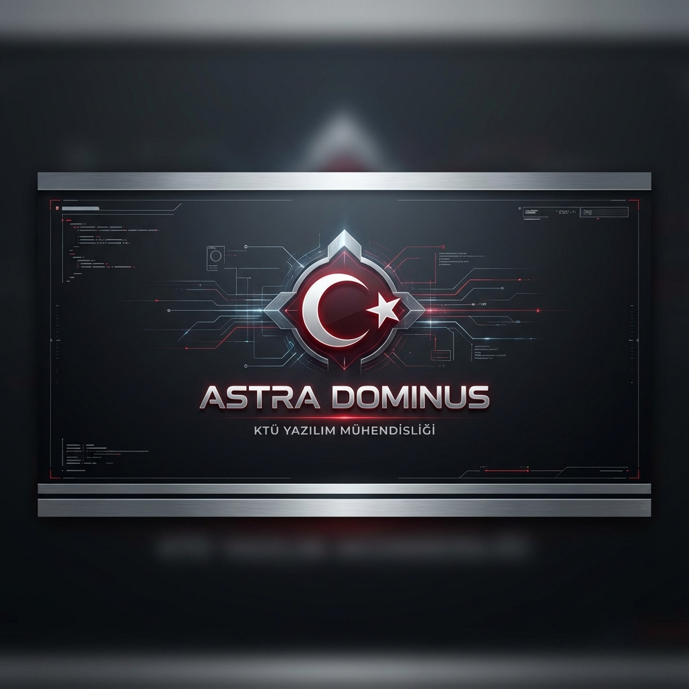
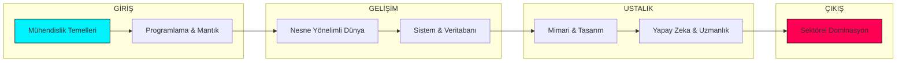

<p align="center">
  
</p>

<div align="center">

# 🛡️ MİLLİ YAZILIM ÜSSÜ // SINIR TANIMAZ AKADEMİ
### [ ELİT YERLİ MÜHENDİSLİK TERMİNALİ // KTÜ ]

<p align="center">
  
  
  
</p>

---

</div>

## 🎯 MİSYON VE VİZYON
**Milli Yazılım Üssü**, Karadeniz Teknik Üniversitesi Yazılım Mühendisliği (2018-2022) akademik mirasını, sadece bir "not deposu" olmanın ötesine taşıyarak, dünya standartlarında bir **Öğrenme ve Mühendislik Ekosistemi**'ne dönüştürmek amacıyla inşa edilmiştir.

### 🏛️ Temel Amaçlarımız:
*   **Faydalı Olmak:** Karmaşık akademik bilgiyi, herkesin anlayabileceği ve uygulayabileceği netlikte sunmak.
*   **Yol Göstermek:** Bir mühendis adayının 1. sınıftan mezuniyete (ve ötesine) kadar olan yolculuğunda teknik ve stratejik akıl hocalığı yapmak.
*   **Öğretmek ve İlham Vermek:** Teorik bilgiyi "Mühendislik Pratiği" ve "Ustalık Doktrinleri" ile harmanlayarak bir vizyon kazandırmak.

---

## 🏗️ SİSTEM MİMARİSİ (DİZİN YAPISI)
Repo hiyerarşisi, profesyonel bir yazılım projesi standartlarında, stratejik katmanlara ayrılarak yapılandırılmıştır.

```text
📦 KTU-YAZILIM-MUHENDISLIGI
 ┣ 📂 DOKTRIN_VE_STRATEJI  — Anayasal felsefe, güvenlik ve katılım protokolleri.
 ┣ 📂 GELISIM_MERKEZI      — Kariyer rotaları, portfolyo rehberleri ve arşiv erişimi.
 ┣ 📂 TEKNIK_KUTUPHANE     — SOLID, SDLC, mülakat hazırlığı ve teknik sözlük.
 ┣ 📂 SISTEM_KODLAR        — Müfredat matrisi ve akademik istihbarat merkezi.
 ┣ 📂 1-4. SINIF           — Yıllara göre ders notları, projeler ve dökümanlar.
 ┗ 📜 README.md            — Ana komuta terminali.
```

---

## ⚡ TAM AKADEMİK MÜFREDAT MATRİSİ (2018-2022)

Bu bölüm, KTÜ Yazılım Mühendisliği mülkiyetindeki tüm akademik dersleri ve içerikleri ana terminale yansıtır.

<details open>
<summary><b>📅 [ 1. SINIF ] - TEMEL MÜHENDİSLİK & ALGORİTMA</b></summary>

| KOD | DERS ADI | KREDİ | BAĞLANTI |
| :--- | :--- | :---: | :--- |
| MAT101 | Matematik - I | 4 | [📂 ERİŞİM](1.%20sınıf/README.md) |
| FIZ101 | Temel Fizik | 3.5 | [📂 ERİŞİM](1.%20sınıf/README.md) |
| YM101 | Programlamaya Giriş ve Algoritma | 3.5 | [📂 ERİŞİM](1.%20sınıf/README.md) |
| YM103 | Yazılım Mühendisliğine Giriş | 2 | [📂 ERİŞİM](1.%20sınıf/README.md) |
| YM104 | Yazılım Gereksinimi Mühendisliği | 2 | [📂 ERİŞİM](1.%20sınıf/README.md) |
| YM106 | Veri Yapıları | 3 | [📂 ERİŞİM](1.%20sınıf/README.md) |
| YM108 | Web Tasarımı ve Programlama | 3 | [📂 ERİŞİM](1.%20sınıf/README.md) |

</details>

<details>
<summary><b>📅 [ 2. SINIF ] - YAZILIM GELİŞTİRME & SİSTEM</b></summary>

| KOD | DERS ADI | KREDİ | BAĞLANTI |
| :--- | :--- | :---: | :--- |
| YM201 | Veri Tabanı ve Yönetimi | 3 | [📂 ERİŞİM](2.%20sınıf/README.md) |
| YM203 | İşletim Sistemleri | 3 | [📂 ERİŞİM](2.%20sınıf/README.md) |
| YM205 | Nesne Yönelimli Programlama | 3 | [📂 ERİŞİM](2.%20sınıf/README.md) |
| MAT201 | Diferansiyel Denklemler | 4 | [📂 ERİŞİM](2.%20sınıf/README.md) |
| YM202 | İleri Web Uygulamaları | 3 | [📂 ERİŞİM](2.%20sınıf/README.md) |
| YM204 | Ayrık Matematik | 2.5 | [📂 ERİŞİM](2.%20sınıf/README.md) |
| YM206 | Mikroişlemciler | 3 | [📂 ERİŞİM](2.%20sınıf/README.md) |
| IST202 | Olasılık ve İstatistik | 3.5 | [📂 ERİŞİM](2.%20sınıf/README.md) |

</details>

<details>
<summary><b>📅 [ 3. SINIF ] - UZMANLIK & MİMARİ</b></summary>

| KOD | DERS ADI | KREDİ | BAĞLANTI |
| :--- | :--- | :---: | :--- |
| YM301 | Biçimsel Diller ve Otomata | 3 | [📂 ERİŞİM](3.%20sınıf/README.md) |
| YM303 | Yazılım Tasarımı ve Mimarisi | 3.5 | [📂 ERİŞİM](3.%20sınıf/README.md) |
| YM305 | Sistem Programlama | 2.5 | [📂 ERİŞİM](3.%20sınıf/README.md) |
| YM307 | Mobil Uygulama Geliştirme | 2 | [📂 ERİŞİM](3.%20sınıf/README.md) |
| YM302 | Bilgisayar Ağları | 2.5 | [📂 ERİŞİM](3.%20sınıf/README.md) |
| YM304 | Yazılım Sınama ve Doğrulama | 2.5 | [📂 ERİŞİM](3.%20sınıf/README.md) |
| YM306 | Yapay Zekâ | 3.5 | [📂 ERİŞİM](3.%20sınıf/README.md) |

</details>

<details>
<summary><b>📅 [ 4. SINIF ] - PROFESYONEL ÜRÜN & SEKTÖR </b></summary>

| KOD | DERS ADI | KREDİ | BAĞLANTI |
| :--- | :--- | :---: | :--- |
| YM401 | İşyeri Eğitimi (Staj) | - | [📂 ERİŞİM](4.%20sınıf/README.md) |
| YM403 | Bitirme Projesi | - | [📂 ERİŞİM](4.%20sınıf/README.md) |
| YM402 | Yazılım Kalite Güvencesi | 3 | [📂 ERİŞİM](4.%20sınıf/README.md) |
| YM404 | Proje Yönetimi | 3 | [📂 ERİŞİM](4.%20sınıf/README.md) |
| YM406 | Veri Madenciliği | 2 | [📂 ERİŞİM](4.%20sınıf/README.md) |

</details>

---

## 🛰️ STRATEJİK PORTALLAR VE İÇERİK TANITIMI
Bu bölüm, reponun kalbindeki dökümanları fonksiyonel gruplarına göre tanıtır ve sizi doğru terminale yönlendirir.

### 🏛️ [ MODÜL: DOKTRİN VE STRATEJİ ]
Bu portal, bir yazılım mühendisinin teknik bilgisinden önce sahip olması gereken **zihin yapısını ve etik değerleri** inşa eder.
*   **[⚓ Mühendislik Manifestosu](DOKTRIN_VE_STRATEJI/MANIFESTO.md):** Sistemin anayasası. Neden kod yazdığımızın ve hangi felsefeyle ilerlediğimizin yanıtı.
*   **[📜 Sistem Doktrini](DOKTRIN_VE_STRATEJI/DOCTRINE.md):** Mühendislikte mükemmellik standartları ve operasyonel disiplin rehberi.
*   **[🛡️ Güvenlik Protokolü](DOKTRIN_VE_STRATEJI/SECURITY.md):** Veri güvenliği ve açık kaynaklı işbirliğinde korunma taktikleri.
> [!TIP]
> **Eylem:** [Mühendislik Zihnini İnşa Et](DOKTRIN_VE_STRATEJI/MANIFESTO.md)

---

### 🚀 [ MODÜL: PROFESYONEL GELİŞİM MERKEZİ ]
Akademik başarıyı **sektörel kariyere** dönüştüren köprüdür. Stratejik yol haritaları ve operasyonel rehberleri içerir.
*   **[🛣️ Kariyer Rotaları](GELISIM_MERKEZI/PATHWAYS.md):** KTÜ müfredatına göre hangi uzmanlık alanına (AI, Web, Mobile) yönelmeniz gerektiğini belirler.
*   **[🎯 Portfolyo Tasarımı](GELISIM_MERKEZI/PORTFOLYO.md):** Sizi diğer adaylardan ayıracak projelerin ve GitHub profilinin nasıl inşa edileceğini öğretir.
*   **[💼 Staj & Kariyer Taktikleri](GELISIM_MERKEZI/STAJ_REHBERI.md):** CV hazırlamadan mülakat masasına kadar olan tüm iş arama sürecini yönetir.
*   **[🐍 Teknoloji Yol Haritaları](GELISIM_MERKEZI/TEKNOLOJI_ROTALARI.md):** C#, Java, Python ve C++ dillerinde ustalığa giden spesifik adımlar.
> [!TIP]
> **Eylem:** [Kariyerini Planlamaya Başla](GELISIM_MERKEZI/PATHWAYS.md)

---

### 🧩 [ MODÜL: TEKNİK KÜTÜPHANE VE AKADEMİ ]
Mühendislik sanatının **teknik derinliğine** odaklanır. Okulda öğrenilen teoriyi piyasa standartlarına çeker.
*   **[📐 SOLID ve Mimari Prensipler](TEKNIK_KUTUPHANE/SOLID_VE_MIMARI.md):** Karmaşık sistemleri yönetilebilir ve sürdürülebilir kılacak tasarım doktrinleri.
*   **[🔄 Yazılım Yaşam Döngüsü (SDLC)](TEKNIK_KUTUPHANE/YAZILIM_YASAM_DONGUSU.md):** Bir fikrin profesyonel bir ürüne dönüşme aşamaları ve metodolojiler.
*   **[📖 Teknik Terimler Sözlüğü](TEKNIK_KUTUPHANE/TEKNIK_SOZLUK.md):** Sektör jargonuna ve teknik terimlere %100 hakimiyet sağlayan sözlük.
*   **[🎤 Mülakat Antrenmanları](TEKNIK_KUTUPHANE/MULAKAT_ANTRENMANI.md):** Seviye seviye ayrılmış gerçekçi teknik mülakat soruları ve yanıtları.
*   **[📚 Teknik Kaynak Kütüphanesi](TEKNIK_KUTUPHANE/TEKNIK_KAYNAKLAR.md):** Dünya çapında kürate edilmiş en iyi eğitim kaynaklarının listesi.
> [!TIP]
> **Eylem:** [Teknik Bilgini Derinleştir](TEKNIK_KUTUPHANE/SOLID_VE_MIMARI.md)

---

### 📊 [ MODÜL: SİSTEM ÇEKİRDEĞİ VE ARŞİV ]
Reponun temelini oluşturan **akademik hafıza ve veri** merkezidir.
*   **[📑 Müfredat Matrisi](SISTEM_KODLAR/SYSTEM_CORE_MATRIX.md):** 1. sınıftan 4. sınıfa tüm derslerin detaylı dökümü ve durumu.
*   **[🛰️ İstihbarat Merkezi](SISTEM_KODLAR/INTEL_CENTER.md):** KTÜ Yazılım Mühendisliği hakkında en çok sorulan sorular ve stratejik bilgiler.
*   **[🌌 Arşiv Protokolü](GELISIM_MERKEZI/ARCHIVE_PROTOCOL.md):** Bulut tabanlı ders notları ve projelere erişim sağlamak için gereken adımlar.
> [!TIP]
> **Eylem:** [Akademik Arşivi Keşfet](GELISIM_MERKEZI/ARCHIVE_PROTOCOL.md)

---

## 📈 AKADEMİK EVRİM ŞEMASI
Bu şema, KTÜ Yazılım Mühendisliği programındaki 4 yıllık teknik dönüşümünüzün görsel özetidir.



---

<div align="center">

**[ Kod Bir Sanattır. Mühendislik ise O Sanatı Dünyaya İnşa Etmektir. ]**

` Trabzon, TÜRKİYE ` // ` 2018 - 2022 Akademik Hafızası `

</div>
