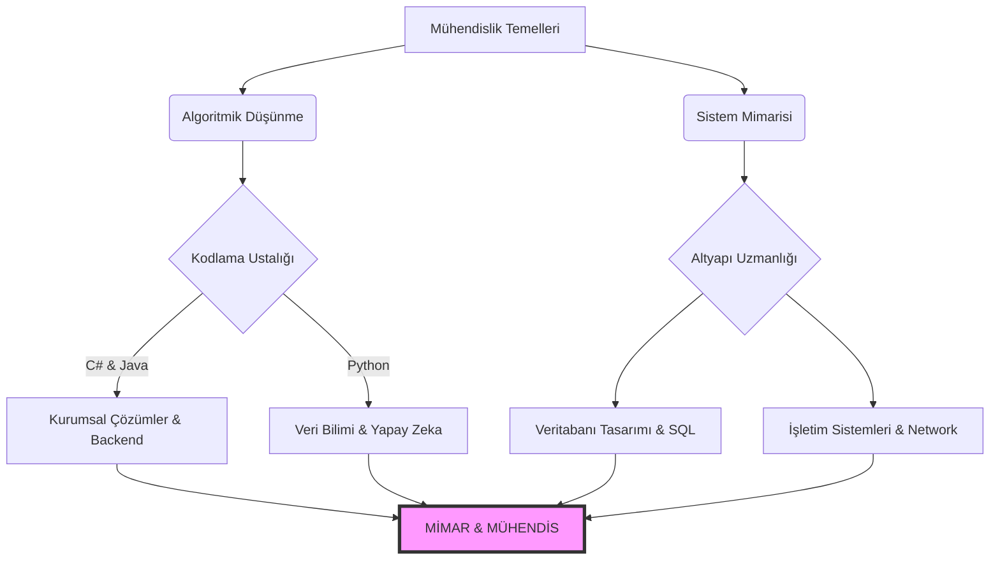

  

# 🏛️ MÜHENDİSLİK TEMELLERİ VE KÖKENLERİ
### [ KLASİK YAZILIM MÜHENDİSLİĞİ ARŞİVİ // KTÜ ]

  
  
  

---

### ⚠️ ÖNEMLİ YÖNLENDİRME: Geleceği mi Arıyorsun?
Burası **Mühendislik Kökleridir**. Eğer **Post-AI (Yapay Zeka Sonrası)** modern müfredatı, LLM entegrasyonlarını, Bulut (Cloud) tabanlı mimarileri ve yeni nesil "Agentic" mühendislik doktrinini arıyorsan, aşağıdaki solucan deliğini kullanmalısın. Unutma, gelecek orada inşa ediliyor; ancak geçmiş burada saklanıyor.

> [!IMPORTANT]
> 🚀 **[POST-AI MÜFREDATI VE İLERİ SEVİYE NEXUS İÇİN TIKLA](https://github.com/bahattinyunus/ktu-software-engineering)**
> *Yapay Zeka, Modern Mimari ve Geleceğin Kodları için geçiş kapısı.*

---

## 🌌 KÖKENLER VE MİRAS: BİR MÜHENDİSİN YOLCULUĞU
Bu depo, sadece bir üniversite ders notları arşivi değildir; burası bir binanın **temelidir (foundation)**. Gökdelenler inşa etmek istiyorsanız, zemin katın altındaki o karanlık ama sağlam betonarme yapıyı, yani Klasik Bilgisayar Bilimleri teorisini anlamak zorundasınız. Üst katları (Yapay Zeka, Bulut Mimarileri, Mikroservisler) çıkmadan önce, betonun ve demirin sağlam olduğundan, yani Algoritmaların ve Veri Yapılarının sarsılmaz olduğundan emin olmalısınız.

Burası **Geleneksel Yazılım Mühendisliği** disiplininin korunduğu kutsal bir alandır. Modern framework'lerin (React, Flutter, Spring) sürekli değişen dünyasının aksine; Algoritmalar, Veri Yapıları, İşletim Sistemleri mantığı ve Temel Mimari prensipler burada saf ve değişmez halleriyle saklanır. Bu bilgiler, son kullanma tarihi olmayan, her dönem geçerli olan evrensel doğrulardır.

### 🏆 ORİJİNAL MİMAR VE İTİBAR
Mühendislik, kümülatif bir bilimdir; yani bilgi birikimi üst üste eklenerek büyür. Bu devasa bilgi birikimi ve akademik hafıza, **Rabia Yılmaz** ([@rabiayilmazz](https://github.com/rabiayilmazz)) tarafından büyük bir titizlikle inşa edilmiştir. Onun emeği, bu arşivin kalbini oluşturur.
Bizim yaptığımız görev ise, bu sağlam temeli korumak, modernize etmek ve yeni nesil mühendislerin anlayabileceği bir formatta sunmaktır. Bu repo, onun orijinal çalışmasının bir "fork"u olup, klasik mühendislik mirasını onurlandırmak ve onu global standartlara taşımak için özelleştirilmiştir.

### 👨‍💻 MEVCUT BAKIMCI VE GELİŞTİRİCİ
Bu deponun modernizasyonu, görsel kimliğinin oluşturulması ve **"Klasik Mühendislik"** mirasının korunması **Bahattin Yunus Çetin** tarafından sağlanmaktadır. Buradaki görev; geleceğin teknolojilerini (Post-AI) inşa etmek için gerekli olan **sağlam temelleri** korumak ve orijinal eseri yaşatmaktır.

> **Bahattin Yunus Çetin** // *IT Architect & University Student (Of, Trabzon)*
>
> "Teknolojiyi sadece bir araç olarak değil, dünyayı dönüştüren bir yaşam biçimi olarak görüyorum. Mimari derinliğe, temiz koda ve sistemik düşünceye tutkun bir bilişim mimarı olarak, bu arşivi gelecek nesillere aktarmayı bir borç biliyorum."
>
> 
> 

---

## 🏛️ ORİJİNAL DERS MATERYALLERİ (RABİA YILMAZ ARŞİVİ)
Bu reponun kalbinde, **Rabia Yılmaz** tarafından bizzat hazırlanmış, saf ve değiştirilmemiş ders notları yatmaktadır. Bu bölüm, reponun "altın madenidir".

### [ 📁 ERİŞİME AÇILAN GİZLİ KLASÖR: YAZILIM TASARIMI VE MİMARİSİ ]
Özellikle **3. Sınıf / 1. Dönem** klasöründe saklanan bu arşiv, SOLID prensiplerini sadece teorik olarak değil, **Uygulamalı Kod Örnekleri** ile öğretir.

*   **📄 Ders Notları (.docx):** Her bir prensip (Single Responsibility, Open/Closed...) için hazırlanmış detaylı akademik dökümanlar.
*   **☕ Kaynak Kodlar (.java):** Prensiplerin ihlal edildiği ve düzeltildiği gerçek dünya senaryolarını içeren **Java Projeleri**.

#### 📂 ARŞİV İÇERİĞİ VE HIZLI ERİŞİM:
| KLASÖR | İÇERİK TÜRÜ | AÇIKLAMA |
| :--- | :--- | :--- |
| **[1) S - Single Responsibility](3.%20sınıf/1.dönem/Yazılım%20tasarımı%20ve%20mimarisi/SOLID/1)%20S)** | 📄 Docx + ☕ Java | "Tek Sorumluluk" ilkesinin kod üzerinde uygulanışı. |
| **[2) O - Open/Closed](3.%20sınıf/1.dönem/Yazılım%20tasarımı%20ve%20mimarisi/SOLID/2)%20O)** | 📄 Docx + ☕ Java | Kodun değişime kapalı, gelişime açık olması. |
| **[3) L - Liskov Substitution](3.%20sınıf/1.dönem/Yazılım%20tasarımı%20ve%20mimarisi/SOLID/3)%20L)** | 📄 Docx + ☕ Java | Alt sınıfların mirası doğru taşıması. |
| **[4) I - Interface Segregation](3.%20sınıf/1.dönem/Yazılım%20tasarımı%20ve%20mimarisi/SOLID/4)%20I)** | 📄 Docx + ☕ Java | Arayüzlerin (Interface) atomik parçalanması. |
| **[5) D - Dependency Inversion](3.%20sınıf/1.dönem/Yazılım%20tasarımı%20ve%20mimarisi/SOLID/5)%20D)** | 📄 Docx + ☕ Java | Bağımlılıkların tersine çevrilmesi ve soyutlama. |

> [!TIP]
> **ÖNERİ:** Bu klasörleri indirip IDE'nizde (IntelliJ/Eclipse) açarak çalıştırın. Kod okumak, kitap okumaktan daha öğreticidir.

---

## 🧠 BEYİN YAZILIMI GÜNCELLEMESİ (ÖĞRENMEYİ ÖĞRENMEK)
Kod yazmadan önce, beyninizi programlamanız gerekir. İşte mühendislik zihnini inşa etmenin metodolojileri:

*   **Feynman Tekniği:** Bir konuyu (örn: Pointerlar) 6 yaşındaki bir çocuğa anlatamıyorsanız, anlamamışsınız demektir. Basitleştirin.
*   **Derin Çalışma (Deep Work):** 2 saatlik odaklanmış çalışma, 10 saatlik dağınık çalışmadan değerlidir. Bildirimleri kapatın, akışa (flow) girin.
*   **Aktif Geri Çağırma (Active Recall):** Okuduğunuzu hemen unutursunuz. Kapatın ve "Ne okudum?" diye kendinize sorun. Beyninizi bilgi almaya değil, bilgi üretmeye zorlayın.

[🔗 DETAYLI ÖĞRENME REHBERİ](GELISIM_MERKEZI/REHBER_OGRENME.md)

---

## ⚔️ DİJİTAL CEPHANELİK (TEKNOLOJİ STACK)
Gerçek bir mühendis, alet çantasındaki araçları ne zaman ve nerede kullanacağını bilen kişidir. Bu müfredat kapsamında ustalaşacağınız **ana silahlar** ve onların stratejik değerleri aşağıdadır:

| TEKNOLOJİ | STRATEJİK DEĞER VE KULLANIM ALANI | ROTA |
| :--- | :--- | :---: |
|  | **Kurumsal Mimari & .NET:** Dünya üzerindeki büyük şirketlerin belkemiğidir. Tip güvenliği, performans ve devasa ekosistemi ile özellikle 2. ve 3. Sınıf projelerinin kalbinde yer alır. Arka uç (Backend) mimarisini öğrenmek için mükemmeldir. | [➡️ DETAY](GELISIM_MERKEZI/TEKNOLOJI_ROTALARI.md#1-c-ve-net-ekosistemi) |
|  | **OOP & Tasarım Desenleri:** Nesne Yönelimli Programlama (OOP) mantığının anadilidir. Veri Yapıları, Tasarım Desenleri (Design Patterns) ve büyük ölçekli sistem tasarımları en iyi Java ile öğrenilir. Android ve Enterprise dünyasının hakimidir. | [➡️ DETAY](GELISIM_MERKEZI/TEKNOLOJI_ROTALARI.md#2-java-ve-kurumsal-dunya) |
|  | **Yapay Zeka & Veri Bilimi:** Veri ile oynamak, makine öğrenmesi modelleri geliştirmek ve hızlı prototipleme yapmak için rakipsizdir. 3. ve 4. Sınıf Yapay Zeka derslerinin ve Görüntü İşleme projelerinin motorudur. | [➡️ DETAY](GELISIM_MERKEZI/TEKNOLOJI_ROTALARI.md#3-python-ve-yapay-zeka) |
|  | **Sistem & Algoritma:** Makineye en yakın dildir. Bellek yönetimi (memory management), pointer aritmetiği ve performans optimizasyonu burada öğrenilir. İşletim Sistemleri dersinin ve yüksek performanslı algoritmaların temelidir. | [➡️ DETAY](GELISIM_MERKEZI/TEKNOLOJI_ROTALARI.md#4-c-ve-sistem-programlama) |
|  | **Veri Tabanı Yönetimi:** Veri, yeni petroldür; SQL ise onu çıkaran sondajdır. İlişkisel veritabanlarını yönetmek, sorgulamak ve optimize etmek, her mühendisin sahip olması gereken temel bir yetkinliktir. | - |

---

## 🏗️ MÜHENDİSLİK DOKTRİNİ (SOLID VE PRENSİPLER)
Bu repo, sadece "nasıl" kod yazılacağını değil, "neden" öyle yazılması gerektiğini savunur. **SOLID**, sürdürülebilir bir mimarinin anayasasıdır.

> **[S]ingle Responsibility (Tek Sorumluluk):** Bir sınıfın veya metodun hayatta kalmak için sadece **bir nedeni** olmalıdır. İsviçre çakısı gibi her işi yapan sınıflardan kaçının.
>
> **[O]pen/Closed (Açıklık/Kapalılık):** Sisteminizi, kodunuzu değiştirmeden yeni özellikler ekleyebileceğiniz (extend) şekilde tasarlayın. Bir "if" bloğuna dokunmak zorunda kalıyorsanız, tasarımınızı sorgulayın.
>
> **[L]iskov Substitution:** Alt sınıflar, üst sınıfların yerine **sorunsuz** geçebilmelidir. Bir `Kare`, bir `Dikdörtgen` gibi davranamıyorsa, miras almamalıdır.
>
> **[I]nterface Segregation:** Devasa arayüzler yerine, müşteriye (class'a) özel, odaklanmış arayüzler tasarlayın. Kullanmadığınız metoda bağımlı olmayın.
>
> **[D]ependency Inversion:** Detaylara değil, soyutlamalara (Abstraction) bağımlı olun. "New" anahtar sözcüğü en büyük düşmanınız olabilir.

[🔗 DETAYLI ANALİZ İÇİN TEKNİK KÜTÜPHANEYE GİDİN](TEKNIK_KUTUPHANE/SOLID_VE_MIMARI.md)

---

## 🔄 YAZILIM YAŞAM DÖNGÜSÜ (SDLC)
Kod yazmak, işin sadece %20'sidir. Profesyonel bir ürünün doğum süreci şöyledir:

1.  **Analiz:** "Ne yapıyoruz?" sorusu. Kullanıcı hikayeleri ve gereksinimlerin belirlenmesi. En kritik aşamadır; yanlış analiz, çöp projedir.
2.  **Tasarım (Design):** Mimari çizim, Veritabanı şeması ve UI/UX. Koda el sürmeden önce zihinde bitirme aşaması.
3.  **Geliştirme (Implementation):** Temiz kod standartlarına göre kodlama.
4.  **Test:** Unit testlerden Kullanıcı Kabul Testlerine (UAT) kadar doğrulama. "Test edilmemiş kod, bozuk koddur."
5.  **Deploy (Dağıtım):** Ürünün canlıya (Production) çıkışı ve CI/CD süreçleri.

[🔗 SDLC DETAYLARI](TEKNIK_KUTUPHANE/YAZILIM_YASAM_DONGUSU.md)

---

## 🎯 MÜLAKAT MEYDANI (ARENA)
Okul bittiğinde karşılaşacağınız "Boss Fight"lara şimdiden hazırlanın. İşte sektörün sizi tartacağı terazi:

| SEVİYE | ÖRNEK MÜLAKAT SORUSU | BEKLENEN YAKLAŞIM |
| :--- | :--- | :--- |
| **🟢 JUNIOR** (1-2. Sınıf) | "Bir diziyi tersten çeviren algoritmayı O(n) süresinde nasıl yazarsın?" | Hazır kütüphane kullanmak yerine döngü mantığını ve indeks yönetimini göstermeniz beklenir. |
| **🟡 MID-LEVEL** (3. Sınıf) | "Singleton tasarım kalıbı nedir ve Thread-Safe olarak nasıl implemente edilir?" | Sadece tanımı değil, 'neden' kullanıldığını ve çoklu iş parçacığı (concurrency) risklerini bilmeniz gerekir. |
| **🔴 SENIOR** (4. Sınıf+) | "Mikroservis mimarisinin monolitik yapıya göre Dezavantajları nelerdir?" | Herkes avantajları sayar; bir mimar ise "Network Latency", "Distributed Transactions" gibi maliyetleri bilir. |

[🔗 DAHA FAZLA SORU İÇİN ANTRENMAN SAHASINA GİDİN](TEKNIK_KUTUPHANE/MULAKAT_ANTRENMANI.md)

---

## 🚀 KARİYER VE PORTFOLYO HARİTASI
Diplomanız sizi mülakata sokar, ancak GitHub profiliniz sizi işe aldırır. Her yılın bir çıktısı olmalıdır:

*   **📍 1. SINIF (TEMEL):** Basit algoritmik oyunlar (Yılan Oyunu, Tetris). Terminal ekranında çalışsa bile kodun temiz olmalı. **Git** kullanmayı öğrenin.
*   **📍 2. SINIF (VERİ):** Veritabanı bağlantılı masaüstü uygulamaları (Otomasyonlar). SQL ve OOP'yi birleştirin.
*   **📍 3. SINIF (WEB/MOBİL):** Artık son kullanıcıya dokunan ürünler. Bir e-ticaret sitesi veya mobil uygulama kurgulayın. Bir "Tech Stack" seçin (Örn: .NET veya Flutter).
*   **📍 4. SINIF (PROFESYONEL):** Mikroservisler, API Gateway'ler veya kompleks AI modelleri. Bitirme projenizi bir "Ürün" gibi paketleyin (Dockerize edin).

[🔗 ADIM ADIM PORTFOLYO REHBERİ](GELISIM_MERKEZI/PORTFOLYO.md)

---

## ⚡ MÜFREDAT MATRİSİ: AKADEMİK SERÜVEN (2018-2022)

<b>📅 [ 1. SINIF ] - UYANIŞ VE TEMELLERİN ATILMASI</b>

*Burası her şeyin başladığı yerdir. Mühendislik formasyonunun kazanıldığı, "Kodlamadan önce Düşünmeyi" öğrendiğiniz yıldır. Ham zihinlerin, algoritmik düşünce yapısıyla yeniden şekillendirildiği bir ocaktır.*

| KOD | DERS | STRATEJİK ÖNEM | İÇERİK |
| :--- | :--- | :--- | :--- |
| MAT101 | Matematik - I | Analitik düşüncenin alfabesidir. | [📂 DERS NOTLARI](1.%20sınıf/README.md) |
| YM101 | Algoritma ve Programlama | Bir problemi bilgisayarın anlayacağı dilde ifade etme sanatıdır. | [📂 DERS NOTLARI](1.%20sınıf/README.md) |
| YM106 | Veri Yapıları | Veriyi hafızada en verimli şekilde saklama ve işleme bilimidir. | [📂 DERS NOTLARI](1.%20sınıf/README.md) |

<b>📅 [ 2. SINIF ] - SİSTEM İNŞASI VE DERİNLEŞME</b>

*Teorinin pratiğe döküldüğü, kodların anlamlı sistemlere dönüştüğü yıllar. Veritabanları, Nesne Yönelimli Programlama ve İşletim Sistemleri ile dijital dünyanın motorunu inşa ettiğiniz dönemdir.*

| KOD | DERS | STRATEJİK ÖNEM | İÇERİK |
| :--- | :--- | :--- | :--- |
| YM201 | Veri Tabanı Yönetimi | Modern uygulamaların kalbi olan veriyi yönetme sanatıdır. | [📂 DERS NOTLARI](2.%20sınıf/README.md) |
| YM203 | İşletim Sistemleri | Donanım ile yazılım arasındaki o büyülü katmanı anlama dersidir. | [📂 DERS NOTLARI](2.%20sınıf/README.md) |
| YM205 | Nesne Yönelimli Programlama | Karmaşıklığı yönetmek için kodu "nesneler" olarak modelleme disiplinidir. | [📂 DERS NOTLARI](2.%20sınıf/README.md) |

<b>📅 [ 3. SINIF ] - MİMARİ TASARIM VE UZMANLIK</b>

*Artık sadece "nasıl" kod yazılacağını değil, sistemin "nasıl" tasarlanacağını öğrendiğiniz yıl. Büyük resmi görmeye başladığınız, Ağlar, Yapay Zeka ve Mimari ile uzmanlaştığınız seviyedir.*

| KOD | DERS | STRATEJİK ÖNEM | İÇERİK |
| :--- | :--- | :--- | :--- |
| YM303 | Yazılım Mimarisi | Sürdürülebilir ve ölçeklenebilir sistemlerin krokisini çizmektir. | [📂 DERS NOTLARI](3.%20sınıf/README.md) |
| YM302 | Bilgisayar Ağları | Dünyayı birbirine bağlayan internetin damarlarını keşfetmektir. | [📂 DERS NOTLARI](3.%20sınıf/README.md) |
| YM306 | Yapay Zeka (Klasik Yaklaşım) | Makinelere düşünmeyi (veya taklit etmeyi) öğretme girişimidir. | [📂 DERS NOTLARI](3.%20sınıf/README.md) |

---

## 📈 YETENEK AĞACI: KARİYER EVRİMİ
4 yıllık akademik eğitimin sonunda, sıradan bir öğrenciden yetkin bir mühendise dönüşüm sürecinizin görsel haritası.

---

## 📖 TEKNİK SÖZLÜK (JARGON BUSTER)
Mühendis gibi konuşmayı öğrenin. İşte sektörde her gün duyacağınız terimlerin "Mühendisçesi":

*   **Abstraction (Soyutlama):** Detaylarda boğulmadan büyük resmi görmektir. Arabayı kullanmak için motorun nasıl çalıştığını bilmenize gerek yoktur.
*   **Encapsulation (Kapsülleme):** Veriyi korumaktır. Hapın içindeki ilacı (veriyi), dış etkilerden koruyan kapsül gibidir.
*   **Polymorphism (Çok Biçimlilik):** Aynı komutun, farklı nesnelerde farklı işlev görmesidir. "Ses Çıkar" komutu; Köpek için "Havla", Kedi için "Miyavla" demektir.
*   **CI/CD (Sürekli Entegrasyon):** Kodun yazılmasından canlıya alınmasına kadar olan sürecin otomatize edilmesidir.

[🔗 TÜM TEKNİK TERİMLER](TEKNIK_KUTUPHANE/TEKNIK_SOZLUK.md)

---

## 🤝 STAJ VE SEKTÖR STRATEJİSİ
Mezun olmadan önce yapmanız gereken "Operasyonel Hamleler":

*   **GitHub Senin Diploman:** Boş reprolar değil, `README`si olan bitirilmiş projeler ekleyin.
*   **Coğrafya Kader Değildir:** Trabzon Teknokent yerel bir başlangıçtır, ancak hedefiniz Remote (İstanbul/Global) olmalıdır.
*   **Network:** LinkedIn'de sadece okul arkadaşlarınızı değil, hedeflediğiniz şirkette çalışan mühendisleri ekleyin.
*   **Mülakat Taktikleri:** "Bilmiyorum" demekten korkmayın, "Nasıl öğrenirim?" veya "Mantığını şöyle kurarım" diyerek analitik zekanızı gösterin.

[🔗 DETAYLI STAJ REHBERİ İÇİN TIKLAYIN](GELISIM_MERKEZI/STAJ_REHBERI.md)

---

## 🛰️ DEĞİŞMEZ PRENSİPLER (STRATEJİK DÖKÜMANLAR)
Teknoloji değişir, diller eskir, framework'ler ölür; ancak prensipler yaşar.

*   **[⚓ Temel Mühendislik Manifestosu](DOKTRIN_VE_STRATEJI/MANIFESTO.md):** Zamanın ötesindeki doğrular, mühendislik etiği ve mesleki duruşumuz.
*   **[📜 Katkı ve Onur Yasası](CONTRIBUTING.md):** Açık kaynak dünyasına saygı duruşu, işbirliği kültürü ve "Centilmenler Kulübü" kuralları.

---

**[ GEÇMİŞİ BİLMEYEN, GELECEĞİ KODLAYAMAZ. ]**

` Trabzon, TÜRKİYE ` // ` Orijinal Kaynak: Rabia Yılmaz `

