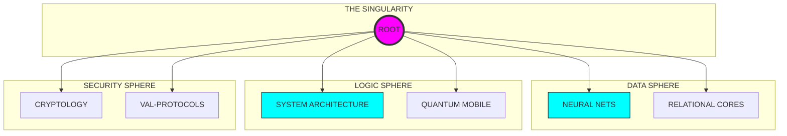

<p align="center">
  
</p>

<div align="center">

# 🌌 ASTRA DOMINUS // SYNC: ACTIVE
### [ UNIVERSAL CODE TERMINAL // ZERO-POINT INTERFACE ]

<p align="center">
  
  
  
</p>

---

</div>

## 🛰️ SYSTEM OVERVIEW & TELEMETRY
**KTÜ Yazılım Mühendisliği** bilgi ekosistemi, artık lineer bir döküman deposu olmaktan çıkmış; çok boyutlu bir teknik doktrin merkezine evrilmiştir. Aradığınız her şey, olay ufkunun hemen ötesinde.

```text
[ STATUS ]    ASCENSION PROTOCOL: COMPLETED
[ IDENTITY ]  KTU-SE-SINGULARITY-V4
[ PURPOSE ]   NEURAL ARCHITECTURE SEEDING
```

---

## ⚡ CORE NEURAL MODULES

| DIMENSION | INTERFACE | FREQUENCY |
| :--- | :--- | :--- |
| **01: FOUNDATION** | [TERMINAL ACCESS L1](1.%20sınıf/README.md) | `SYNCING...` |
| **02: EVOLUTION** | [TERMINAL ACCESS L2](2.%20sınıf/README.md) | `STABLE` |
| **03: SYNTHESIS** | [TERMINAL ACCESS L3](3.%20sınıf/README.md) | `STABLE` |
| **04: DOMINANCE** | [TERMINAL ACCESS L4](4.%20sınıf/README.md) | `LOCKED` |

---

## 🏗️ SYSTEM SCHEMATIC (GLOBAL CURRICULUM)



---

## 📓 THE BLACK BOX CODICES

<p align="center">
<a href="MANIFESTO.md"></a>
<a href="SYSTEM_CORE_MATRIX.md"></a>
<a href="INTEL_CENTER.md"></a>
<a href="SECURITY.md"></a>
<a href="DOCTRINE.md"></a>
</p>

---

## 🌌 THE ARCHIVE PROTOCOL
Bulut tabanlı tüm dökümanlara (Ders Notları, Çıkmışlar, Projeler) erişim sağlamak için `THE ARCHIVE` kapısını aralayın. Erişim yetkisi için **Tekil Onay** gerekmektedir.

> [!CAUTION]
> **Warning:** Bilgi ağır bir yüktür. Onu taşımaya hazır mısınız? [ARCHIVE_PROTOCOL.md](ARCHIVE_PROTOCOL.md) adresini ziyaret edin.

---

<div align="center">

### [ ⚡ FREQUENCY ESTABLISHED ]

`yyilmazrabiaa@gmail.com` // ` Trabzon, TURKEY `

**There is no spoon. Just code.**

</div>
