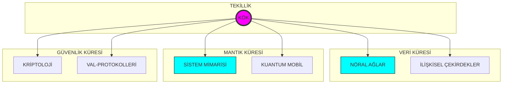

<p align="center">
  
</p>

<div align="center">

# 🌌 ASTRA DOMINUS // SENKRONİZASYON: AKTİF
### [ EVRENSEL KOD TERMİNALİ // SIFIR-NOKTASI ARAYÜZÜ ]

<p align="center">
  
  
  
</p>

---

</div>

## 🛰️ SİSTEM GENEL BAKIŞ & TELEMETRİ
**KTÜ Yazılım Mühendisliği** bilgi ekosistemi, artık lineer bir döküman deposu olmaktan çıkmış; çok boyutlu bir teknik doktrin merkezine evrilmiştir. Aradığınız her şey, olay ufkunun hemen ötesinde.

```text
[ DURUM ]      YÜKSELİŞ PROTOKOLÜ: TAMAMLANDI
[ KİMLİK ]     KTU-YM-TEKİLLİK-V4
[ AMAÇ ]       NÖRAL MİMARİ TOHUMLAMA (ÖĞRETME VE REHBERLİK)
```

---

## ⚡ ÇEKİRDEK NÖRAL MODÜLLER (SINIFLAR)

| BOYUT | ARAYÜZ | FREKANS |
| :--- | :--- | :--- |
| **01: TEMELLER** | [TERMİNAL ERİŞİMİ L1](1.%20sınıf/README.md) | `STABİL` |
| **02: EVRİM** | [TERMİNAL ERİŞİMİ L2](2.%20sınıf/README.md) | `STABİL` |
| **03: SENTEZ** | [TERMİNAL ERİŞİMİ L3](3.%20sınıf/README.md) | `STABİL` |
| **04: DOMİNASYON** | [TERMİNAL ERİŞİMİ L4](4.%20sınıf/README.md) | `STABİL` |

---

## 🧠 AYDINLANMA TERMİNALİ (REHBERLİK VE EĞİTİM)
Bu bölüm, teknik bilginin ötesine geçerek size "nasıl bir mühendis olunacağını" öğretmek ve yol göstermek için tasarlanmıştır.

*   **[Öğrenme Metodolojisi](REHBER_OGRENME.md):** Mühendislik derslerini fethetmenin yolları.
*   **[Teknik Sözlük](TEKNIK_SOZLUK.md):** Terminoloji hakimiyeti için kapsamlı rehber.
*   **[Mülakat Antrenmanı](MULAKAT_ANTRENMANI.md):** Teknik mülakatlara hazırlık kampı.
*   **[Staj & Kariyer Rehberi](STAJ_REHBERI.md):** CV'den işe alıma operasyonel yol haritası.
*   **[Teknik Kaynak Kütüphanesi](TEKNIK_KAYNAKLAR.md):** Dünya standartlarında kürate edilmiş eğitim listesi.
*   **[Portfolyo Rehberi](PORTFOLYO.md):** Sektörde fark yaratacak gelişim adımları.

---

## 🏗️ SİSTEM ŞEMATİĞİ (KÜRESEL MÜFREDAT)



---

## 📓 KARA KUTU KODEKSLERİ

<p align="center">
<a href="MANIFESTO.md"></a>
<a href="SYSTEM_CORE_MATRIX.md"></a>
<a href="INTEL_CENTER.md"></a>
<a href="SECURITY.md"></a>
<a href="DOCTRINE.md"></a>
</p>

---

## 🌌 ARŞİV PROTOKOLÜ
Bulut tabanlı tüm dökümanlara (Ders Notları, Çıkmışlar, Projeler) erişim sağlamak için `ARŞİV` kapısını aralayın. [ARCHIVE_PROTOCOL.md](ARCHIVE_PROTOCOL.md) adresini ziyaret edin.

---

<div align="center">

### [ ⚡ FREKANS KURULDU ]

`yyilmazrabiaa@gmail.com` // ` Trabzon, TÜRKİYE `

**Kod hayattır. Bilgelik rehberdir.**

</div>
