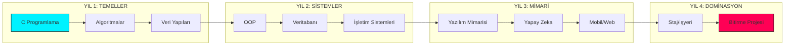

<p align="center">
  
</p>

<div align="center">

# 🌌 ASTRA DOMINUS // SENKRONİZASYON: AKTİF
### [ EVRENSEL KOD TERMİNALİ // SIFIR-NOKTASI ARAYÜZÜ ]

<p align="center">
  
  
  
</p>

---

</div>

## 🛰️ SİSTEM GENEL BAKIŞ & TELEMETRİ
**KTÜ Yazılım Mühendisliği** bilgi ekosistemi, artık lineer bir döküman deposu olmaktan çıkmış; çok boyutlu bir teknik doktrin merkezine evrilmiştir. Aradığınız her şey, olay ufkunun hemen ötesinde.

```text
[ DURUM ]      YÜKSELİŞ PROTOKOLÜ: TAMAMLANDI
[ KİMLİK ]     KTU-YM-TEKİLLİK-V4
[ AMAÇ ]       NÖRAL MİMARİ TOHUMLAMA (ÖĞRETME VE REHBERLİK)
```

---

## ⚡ ÇEKİRDEK MÜFREDAT MATRİSİ (1-4. SINIF)

Bu bölüm, KTÜ Yazılım Mühendisliği mülkiyetindeki tüm akademik modülleri ve ders içeriklerini ana terminale yansıtır.

<details open>
<summary><b>📅 [ 1. SINIF ] - TEMEL MÜHENDİSLİK & ALGORİTMA</b></summary>

| KOD | DERS ADI | BAĞLANTI | DURUM |
| :--- | :--- | :---: | :--- |
| MAT101 | Matematik - I | [📂 GİRİŞ](1.%20sınıf/README.md) | `TAMAMLANDI` |
| FIZ101 | Temel Fizik | [📂 GİRİŞ](1.%20sınıf/README.md) | `TAMAMLANDI` |
| YM101 | Programlamaya Giriş | [📂 GİRİŞ](1.%20sınıf/README.md) | `TAMAMLANDI` |
| YM104 | Yazılım Gereksinimleri | [📂 GİRİŞ](1.%20sınıf/README.md) | `TAMAMLANDI` |
| YM108 | Web Tasarımı | [📂 GİRİŞ](1.%20sınıf/README.md) | `TAMAMLANDI` |

</details>

<details>
<summary><b>📅 [ 2. SINIF ] - YAZILIM GELİŞTİRME & SİSTEM</b></summary>

| KOD | DERS ADI | BAĞLANTI | DURUM |
| :--- | :--- | :---: | :--- |
| YM201 | Veritabanı Yönetimi | [📂 ERİŞİM](2.%20sınıf/README.md) | `TAMAMLANDI` |
| YM203 | İşletim Sistemleri | [📂 ERİŞİM](2.%20sınıf/README.md) | `TAMAMLANDI` |
| YM205 | Nesne Yönelimli Programlama | [📂 ERİŞİM](2.%20sınıf/README.md) | `TAMAMLANDI` |
| YM202 | İleri Web Uygulamaları | [📂 ERİŞİM](2.%20sınıf/README.md) | `TAMAMLANDI` |
| IST202 | Olasılık ve İstatistik | [📂 ERİŞİM](2.%20sınıf/README.md) | `TAMAMLANDI` |

</details>

<details>
<summary><b>📅 [ 3. SINIF ] - UZMANLIK & MİMARİ</b></summary>

| KOD | DERS ADI | BAĞLANTI | DURUM |
| :--- | :--- | :---: | :--- |
| YM303 | Yazılım Mimarisi | [📂 ANALİZ](3.%20sınıf/README.md) | `TAMAMLANDI` |
| YM305 | Sistem Programlama | [📂 ANALİZ](3.%20sınıf/README.md) | `TAMAMLANDI` |
| YM307 | Mobil Uygulama Geliştirme | [📂 ANALİZ](3.%20sınıf/README.md) | `TAMAMLANDI` |
| YM302 | Bilgisayar Ağları | [📂 ANALİZ](3.%20sınıf/README.md) | `TAMAMLANDI` |
| YM306 | Yapay Zekâ | [📂 ANALİZ](3.%20sınıf/README.md) | `TAMAMLANDI` |

</details>

<details>
<summary><b>📅 [ 4. SINIF ] - PROFESYONEL UYGULAMA</b></summary>

| KOD | DERS ADI | BAĞLANTI | DURUM |
| :--- | :--- | :---: | :--- |
| YM401 | İşyeri Eğitimi (Staj) | [📂 SEKTÖR](4.%20sınıf/README.md) | `AKTİF` |
| YM403 | Bitirme Projesi | [📂 SEKTÖR](4.%20sınıf/README.md) | `AKTİF` |
| YM402 | Yazılım Kalite Güvencesi | [📂 SEKTÖR](4.%20sınıf/README.md) | `TAMAMLANDI` |
| YM404 | Proje Yönetimi | [📂 SEKTÖR](4.%20sınıf/README.md) | `TAMAMLANDI` |
| YM406 | Veri Madenciliği | [📂 SEKTÖR](4.%20sınıf/README.md) | `TAMAMLANDI` |

</details>

---

## 🧠 AYDINLANMA TERMİNALİ (REHBERLİK VE EĞİTİM)
Bu bölüm, teknik bilginin ötesine geçerek size "nasıl bir mühendis olunacağını" öğretmek ve yol göstermek için tasarlanmıştır.

*   **[Öğrenme Metodolojisi](GELISIM_MERKEZI/REHBER_OGRENME.md):** Mühendislik derslerini fethetmenin yolları.
*   **[Teknik Sözlük](TEKNIK_KUTUPHANE/TEKNIK_SOZLUK.md):** Terminoloji hakimiyeti için kapsamlı rehber.
*   **[Mülakat Antrenmanı](TEKNIK_KUTUPHANE/MULAKAT_ANTRENMANI.md):** Teknik mülakatlara hazırlık kampı.
*   **[Staj & Kariyer Rehberi](GELISIM_MERKEZI/STAJ_REHBERI.md):** CV'den işe alıma operasyonel yol haritası.
*   **[Teknik Kaynak Kütüphanesi](TEKNIK_KUTUPHANE/TEKNIK_KAYNAKLAR.md):** Dünya standartlarında kürate edilmiş eğitim listesi.
*   **[Portfolyo Rehberi](GELISIM_MERKEZI/PORTFOLYO.md):** Sektörde fark yaratacak gelişim adımları.

---

## 🏆 BİLGELİK ZİRVESİ (İLERİ SEVİYE MÜHENDİSLİK)

Mühendislik sanatında derinleşmek ve fark yaratmak isteyenler için ileri seviye doktrinler.

*   **[SOLID ve Mimari Prensipler](TEKNIK_KUTUPHANE/SOLID_VE_MIMARI.md):** Sürdürülebilir sistemlerin tasarımı.
*   **[Yazılım Yaşam Döngüsü (SDLC)](TEKNIK_KUTUPHANE/YAZILIM_YASAM_DONGUSU.md):** Profesyonel ürün geliştirme süreçleri.
*   **[Teknoloji Rotaları](GELISIM_MERKEZI/TEKNOLOJI_ROTALARI.md):** Ana dillerde (C++, Java, C#, Python) uzmanlaşma rehberi.

---

## 🏗️ AKADEMİK YOL HARİTASI (EVRİM ŞEMASI)



---

## 📓 KARA KUTU KODEKSLERİ

<p align="center">
<a href="DOKTRIN_VE_STRATEJI/MANIFESTO.md"></a>
<a href="SISTEM_KODLAR/SYSTEM_CORE_MATRIX.md"></a>
<a href="SISTEM_KODLAR/INTEL_CENTER.md"></a>
<a href="DOKTRIN_VE_STRATEJI/SECURITY.md"></a>
<a href="DOKTRIN_VE_STRATEJI/DOCTRINE.md"></a>
</p>

---

## 🌌 ARŞİV PROTOKOLÜ
Bulut tabanlı tüm dökümanlara (Ders Notları, Çıkmışlar, Projeler) erişim sağlamak için `ARŞİV` kapısını aralayın. [ARCHIVE_PROTOCOL.md](GELISIM_MERKEZI/ARCHIVE_PROTOCOL.md) adresini ziyaret edin.

---

<div align="center">

### [ ⚡ FREKANS KURULDU ]

`yyilmazrabiaa@gmail.com` // ` Trabzon, TÜRKİYE `

**Kod hayattır. Bilgelik rehberdir.**

</div>
