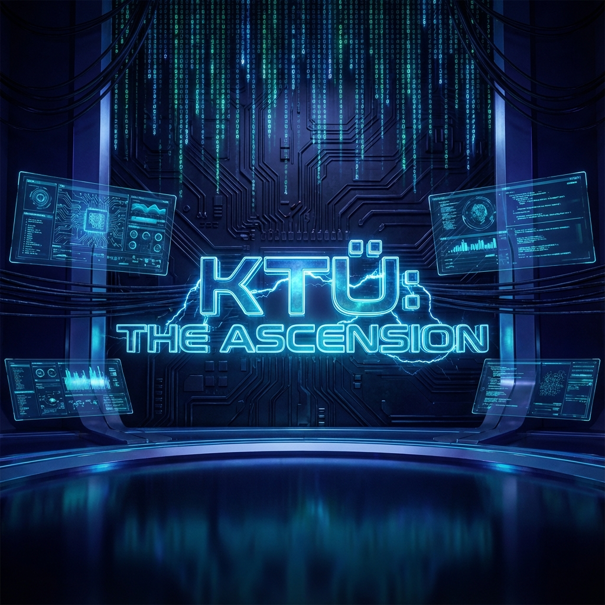
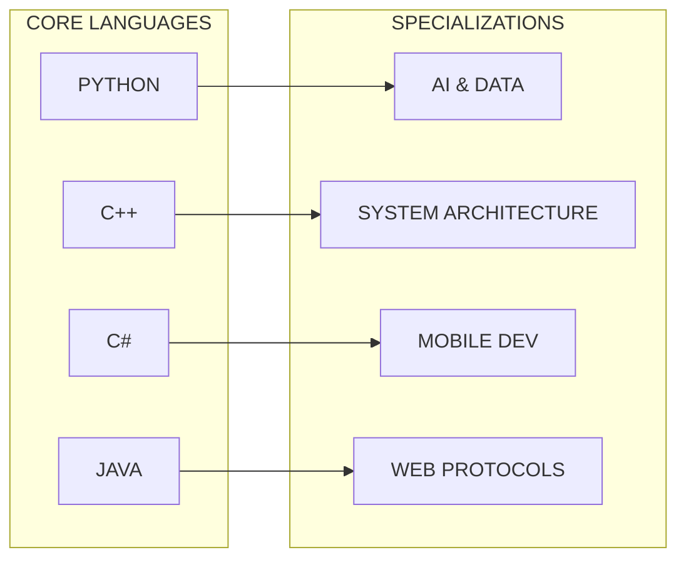

  

# 🌌 KTÜ: THE ASCENSION
### [ ELITE SOFTWARE ENGINEERING HUB // V3.0 ]

  
  
  

---

## 🛡️ MISSION BRIEFING
**Karadeniz Teknik Üniversitesi Yazılım Mühendisliği** ekosistemi için tasarlanmış, geleneksel akademik sınırları aşan, "tanınmaz" derecede gelişmiş bir stratejik bilgi terminaline hoş geldiniz. Bu repository, mühendislik eğitimini bir **Ascension (Yükseliş)** süreci olarak ele alır.

> [!CAUTION]
> **ACCESS PROTOCOL:** Bilgi modüllerine erişim için [INTEL CENTER](INTEL_CENTER.md) protokollerini takip edin. Drive verileri şifrelenmiş değil, ancak erişim onayı manuel validasyon gerektirir.

---

## 🛰️ OPERATIONAL MODULES (CORE)

| MODULE | CODEX | ACCESS STATUS |
| :--- | :--- | :--- |
| **LEVEL 01: FOUNDATION** | [1. Sınıf Modülleri](1.%20sınıf/README.md) | `🟢 STABLE` |
| **LEVEL 02: EVOLUTION** | [2. Sınıf Modülleri](2.%20sınıf/README.md) | `🟢 STABLE` |
| **LEVEL 03: SYNTHESIS** | [3. Sınıf Modülleri](3.%20sınıf/README.md) | `🟢 STABLE` |
| **LEVEL 04: MASTERY** | [4. Sınıf Modülleri](4.%20sınıf/README.md) | `🟢 STABLE` |

---

## 🧩 STRATEGIC ASSETS

---

## ⚡ TECH STACK MATRIX

---

## 🎯 ASCENSION PATHWAY

Bu hub, sizi sadece bir öğrenci değil, bir **Sistem Mimarı** olarak yetiştirmeyi amaçlar. Her klasör, her not ve her döküman bu büyük tasarımın bir parçasıdır.

*   **Logic Extraction:** Algoritma ve matematik temelleri.
*   **System Integration:** İşletim sistemleri ve ağ yapıları.
*   **Architectural Mastery:** Tasarım kalıpları ve temiz kod.
*   **Professional Deployment:** Sektörel eğitim ve bitirme projeleri.

---

### [ 📞 ESTABLISH COMMUNICATION ]

`yyilmazrabiaa@gmail.com` // ` Trabzon, TR `

**Designed for those who build the future.**

