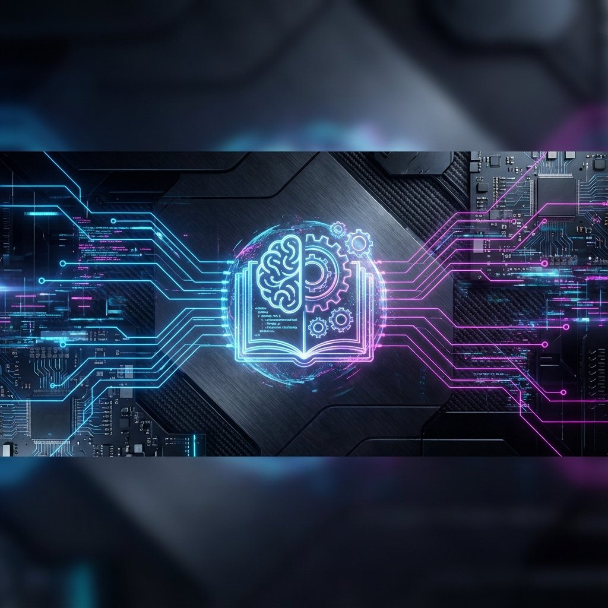
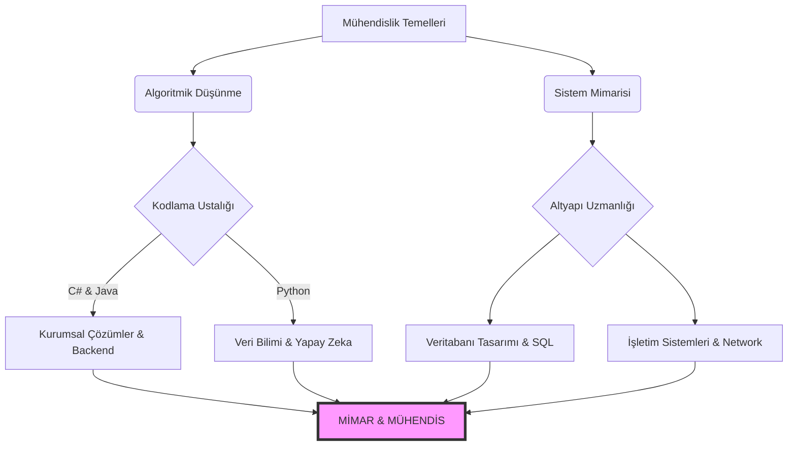

  

# 🏛️ MÜHENDİSLİK TEMELLERİ VE KÖKENLERİ
### [ KLASİK YAZILIM MÜHENDİSLİĞİ ARŞİVİ // KTÜ ]

  
  
  

---

### ⚠️ ÖNEMLİ YÖNLENDİRME: Geleceği mi Arıyorsun?
Burası **Mühendislik Kökleridir**. Eğer **Post-AI (Yapay Zeka Sonrası)** modern müfredatı, LLM entegrasyonlarını, Bulut (Cloud) tabanlı mimarileri ve yeni nesil "Agentic" mühendislik doktrinini arıyorsan, aşağıdaki solucan deliğini kullanmalısın. Unutma, gelecek orada inşa ediliyor; ancak geçmiş burada saklanıyor.

> [!IMPORTANT]
> 🚀 **[POST-AI MÜFREDATI VE İLERİ SEVİYE NEXUS İÇİN TIKLA](https://github.com/bahattinyunus/ktu-software-engineering)**
> *Yapay Zeka, Modern Mimari ve Geleceğin Kodları için geçiş kapısı.*

---

## 🌌 KÖKENLER VE MİRAS: BİR MÜHENDİSİN YOLCULUĞU
Bu depo, sadece bir üniversite ders notları arşivi değildir; burası bir binanın **temelidir (foundation)**. Gökdelenler inşa etmek istiyorsanız, zemin katın altındaki o karanlık ama sağlam betonarme yapıyı, yani Klasik Bilgisayar Bilimleri teorisini anlamak zorundasınız. Üst katları (Yapay Zeka, Bulut Mimarileri, Mikroservisler) çıkmadan önce, betonun ve demirin sağlam olduğundan, yani Algoritmaların ve Veri Yapılarının sarsılmaz olduğundan emin olmalısınız.

Burası **Geleneksel Yazılım Mühendisliği** disiplininin korunduğu kutsal bir alandır. Modern framework'lerin (React, Flutter, Spring) sürekli değişen dünyasının aksine; Algoritmalar, Veri Yapıları, İşletim Sistemleri mantığı ve Temel Mimari prensipler burada saf ve değişmez halleriyle saklanır. Bu bilgiler, son kullanma tarihi olmayan, her dönem geçerli olan evrensel doğrulardır.

### 🏆 ORİJİNAL MİMAR VE İTİBAR
Mühendislik, kümülatif bir bilimdir; yani bilgi birikimi üst üste eklenerek büyür. Bu devasa bilgi birikimi ve akademik hafıza, **Rabia Yılmaz** ([@rabiayilmazz](https://github.com/rabiayilmazz)) tarafından büyük bir titizlikle inşa edilmiştir. Onun emeği, bu arşivin kalbini oluşturur.
Bizim yaptığımız görev ise, bu sağlam temeli korumak, modernize etmek ve yeni nesil mühendislerin anlayabileceği bir formatta sunmaktır. Bu repo, onun orijinal çalışmasının bir "fork"u olup, klasik mühendislik mirasını onurlandırmak ve onu global standartlara taşımak için özelleştirilmiştir.

### 👨‍💻 MEVCUT BAKIMCI VE GELİŞTİRİCİ
Bu deponun modernizasyonu, "Post-AI" vizyonuyla genişletilmesi, görsel kimliğinin oluşturulması ve kurumsal düzeyde yönetimi **Bahattin Yunus Çetin** tarafından sağlanmaktadır. Geçmişin mirasını devralıp, onu geleceğin teknolojisiyle harmanlayan bir vizyon üstlenilmiştir.

> **Bahattin Yunus Çetin** // *IT Architect & University Student (Of, Trabzon)*
>
> "Teknolojiyi sadece bir araç olarak değil, dünyayı dönüştüren bir yaşam biçimi olarak görüyorum. Mimari derinliğe, temiz koda ve sistemik düşünceye tutkun bir bilişim mimarı olarak, bu arşivi gelecek nesillere aktarmayı bir borç biliyorum."
>
> 
> 

---

## ⚔️ DİJİTAL CEPHANELİK (TEKNOLOJİ STACK)
Gerçek bir mühendis, alet çantasındaki araçları ne zaman ve nerede kullanacağını bilen kişidir. Bu müfredat kapsamında ustalaşacağınız **ana silahlar** ve onların stratejik değerleri aşağıdadır:

| TEKNOLOJİ | STRATEJİK DEĞER VE KULLANIM ALANI | ROTA |
| :--- | :--- | :---: |
|  | **Kurumsal Mimari & .NET:** Dünya üzerindeki büyük şirketlerin belkemiğidir. Tip güvenliği, performans ve devasa ekosistemi ile özellikle 2. ve 3. Sınıf projelerinin kalbinde yer alır. Arka uç (Backend) mimarisini öğrenmek için mükemmeldir. | [➡️ DETAY](GELISIM_MERKEZI/TEKNOLOJI_ROTALARI.md#1-c-ve-net-ekosistemi) |
|  | **OOP & Tasarım Desenleri:** Nesne Yönelimli Programlama (OOP) mantığının anadilidir. Veri Yapıları, Tasarım Desenleri (Design Patterns) ve büyük ölçekli sistem tasarımları en iyi Java ile öğrenilir. Android ve Enterprise dünyasının hakimidir. | [➡️ DETAY](GELISIM_MERKEZI/TEKNOLOJI_ROTALARI.md#2-java-ve-kurumsal-dunya) |
|  | **Yapay Zeka & Veri Bilimi:** Veri ile oynamak, makine öğrenmesi modelleri geliştirmek ve hızlı prototipleme yapmak için rakipsizdir. 3. ve 4. Sınıf Yapay Zeka derslerinin ve Görüntü İşleme projelerinin motorudur. | [➡️ DETAY](GELISIM_MERKEZI/TEKNOLOJI_ROTALARI.md#3-python-ve-yapay-zeka) |
|  | **Sistem & Algoritma:** Makineye en yakın dildir. Bellek yönetimi (memory management), pointer aritmetiği ve performans optimizasyonu burada öğrenilir. İşletim Sistemleri dersinin ve yüksek performanslı algoritmaların temelidir. | [➡️ DETAY](GELISIM_MERKEZI/TEKNOLOJI_ROTALARI.md#4-c-ve-sistem-programlama) |
|  | **Veri Tabanı Yönetimi:** Veri, yeni petroldür; SQL ise onu çıkaran sondajdır. İlişkisel veritabanlarını yönetmek, sorgulamak ve optimize etmek, her mühendisin sahip olması gereken temel bir yetkinliktir. | - |

---

## 💎 HAZİNE ODASI (GİZLİ KAYNAKLAR)
Ders notları sadece başlangıçtır. Çoğu öğrencinin gözden kaçırdığı ama kariyerinizde size sınıf atlatacak **paha biçilemez değerdeki** kaynaklar, bu reponun derinliklerinde mevcuttur.

*   **[📚 Teknik Kütüphane](TEKNIK_KUTUPHANE):** Klasik ders notlarının ötesine geçmek, teoriyi pratiğe dökmek isteyenler için özel olarak derlenmiştir.
    *   **[Mimari & SOLID Prensipleri:](TEKNIK_KUTUPHANE/SOLID_VE_MIMARI.md)** Kodun sadece çalışması yetmez, bir sanat eseri gibi zarif, sürdürülebilir ve esnek olmalıdır. Spagetti koddan kaçışın rehberi buradadır.
    *   **[Mülakat Antrenmanları:](TEKNIK_KUTUPHANE/MULAKAT_ANTRENMANI.md)** Okul bittiğinde sizi bekleyen "Teknik Mülakat" canavarını yenmek için gerçekçi senaryolar ve sorular. Sektöre girmeden önceki son çıkış.
    *   **[Teknik Sözlük:](TEKNIK_KUTUPHANE/TEKNIK_SOZLUK.md)** Bir mühendis gibi konuşmak, teknik jargonlara hakim olmak, global ekiplerle çalışırken en büyük avantajınızdır.
*   **[🚀 Profesyonel Gelişim Merkezi](GELISIM_MERKEZI):** Sadece kod yazmayı değil, yazılım dünyasında "kariyer" yapmayı öğretir.
    *   **[Portfolyo Rehberi:](GELISIM_MERKEZI/PORTFOLYO.md)** GitHub profiliniz sizin diplomanızdır. Sizi binlerce aday arasından sıyırıp işe aldıracak o mükemmel vitrini nasıl kuracağınızı anlatır.
    *   **[Staj Taktikleri:](GELISIM_MERKEZI/STAJ_REHBERI.md)** Kurumsal dünyaya ilk adımı atmak en zoru olabilir. Doğru CV, doğru başvuru ve doğru iletişim stratejileri ile kaleyi içeriden fethedin.

---

## ⚡ MÜFREDAT MATRİSİ: AKADEMİK SERÜVEN (2018-2022)

<b>📅 [ 1. SINIF ] - UYANIŞ VE TEMELLERİN ATILMASI</b>

*Burası her şeyin başladığı yerdir. Mühendislik formasyonunun kazanıldığı, "Kodlamadan önce Düşünmeyi" öğrendiğiniz yıldır. Ham zihinlerin, algoritmik düşünce yapısıyla yeniden şekillendirildiği bir ocaktır.*

| KOD | DERS | STRATEJİK ÖNEM | İÇERİK |
| :--- | :--- | :--- | :--- |
| MAT101 | Matematik - I | Analitik düşüncenin alfabesidir. | [📂 DERS NOTLARI](1.%20sınıf/README.md) |
| YM101 | Algoritma ve Programlama | Bir problemi bilgisayarın anlayacağı dilde ifade etme sanatıdır. | [📂 DERS NOTLARI](1.%20sınıf/README.md) |
| YM106 | Veri Yapıları | Veriyi hafızada en verimli şekilde saklama ve işleme bilimidir. | [📂 DERS NOTLARI](1.%20sınıf/README.md) |

<b>📅 [ 2. SINIF ] - SİSTEM İNŞASI VE DERİNLEŞME</b>

*Teorinin pratiğe döküldüğü, kodların anlamlı sistemlere dönüştüğü yıllar. Veritabanları, Nesne Yönelimli Programlama ve İşletim Sistemleri ile dijital dünyanın motorunu inşa ettiğiniz dönemdir.*

| KOD | DERS | STRATEJİK ÖNEM | İÇERİK |
| :--- | :--- | :--- | :--- |
| YM201 | Veri Tabanı Yönetimi | Modern uygulamaların kalbi olan veriyi yönetme sanatıdır. | [📂 DERS NOTLARI](2.%20sınıf/README.md) |
| YM203 | İşletim Sistemleri | Donanım ile yazılım arasındaki o büyülü katmanı anlama dersidir. | [📂 DERS NOTLARI](2.%20sınıf/README.md) |
| YM205 | Nesne Yönelimli Programlama | Karmaşıklığı yönetmek için kodu "nesneler" olarak modelleme disiplinidir. | [📂 DERS NOTLARI](2.%20sınıf/README.md) |

<b>📅 [ 3. SINIF ] - MİMARİ TASARIM VE UZMANLIK</b>

*Artık sadece "nasıl" kod yazılacağını değil, sistemin "nasıl" tasarlanacağını öğrendiğiniz yıl. Büyük resmi görmeye başladığınız, Ağlar, Yapay Zeka ve Mimari ile uzmanlaştığınız seviyedir.*

| KOD | DERS | STRATEJİK ÖNEM | İÇERİK |
| :--- | :--- | :--- | :--- |
| YM303 | Yazılım Mimarisi | Sürdürülebilir ve ölçeklenebilir sistemlerin krokisini çizmektir. | [📂 DERS NOTLARI](3.%20sınıf/README.md) |
| YM302 | Bilgisayar Ağları | Dünyayı birbirine bağlayan internetin damarlarını keşfetmektir. | [📂 DERS NOTLARI](3.%20sınıf/README.md) |
| YM306 | Yapay Zeka (Klasik Yaklaşım) | Makinelere düşünmeyi (veya taklit etmeyi) öğretme girişimidir. | [📂 DERS NOTLARI](3.%20sınıf/README.md) |

---

## 📈 YETENEK AĞACI: KARİYER EVRİMİ
4 yıllık akademik eğitimin sonunda, sıradan bir öğrenciden yetkin bir mühendise dönüşüm sürecinizin görsel haritası. Hangi derste öğrendiğiniz bilginin, sektörde hangi yetkinliğe karşılık geldiğini gösterir.

---

## 🛰️ DEĞİŞMEZ PRENSİPLER (STRATEJİK DÖKÜMANLAR)
Teknoloji değişir, diller eskir, framework'ler ölür; ancak prensipler yaşar.

*   **[⚓ Temel Mühendislik Manifestosu](DOKTRIN_VE_STRATEJI/MANIFESTO.md):** Zamanın ötesindeki doğrular, mühendislik etiği ve mesleki duruşumuz.
*   **[📜 Katkı ve Onur Yasası](CONTRIBUTING.md):** Açık kaynak dünyasına saygı duruşu, işbirliği kültürü ve "Centilmenler Kulübü" kuralları.

---

**[ GEÇMİŞİ BİLMEYEN, GELECEĞİ KODLAYAMAZ. ]**

` Trabzon, TÜRKİYE ` // ` Orijinal Kaynak: Rabia Yılmaz `

