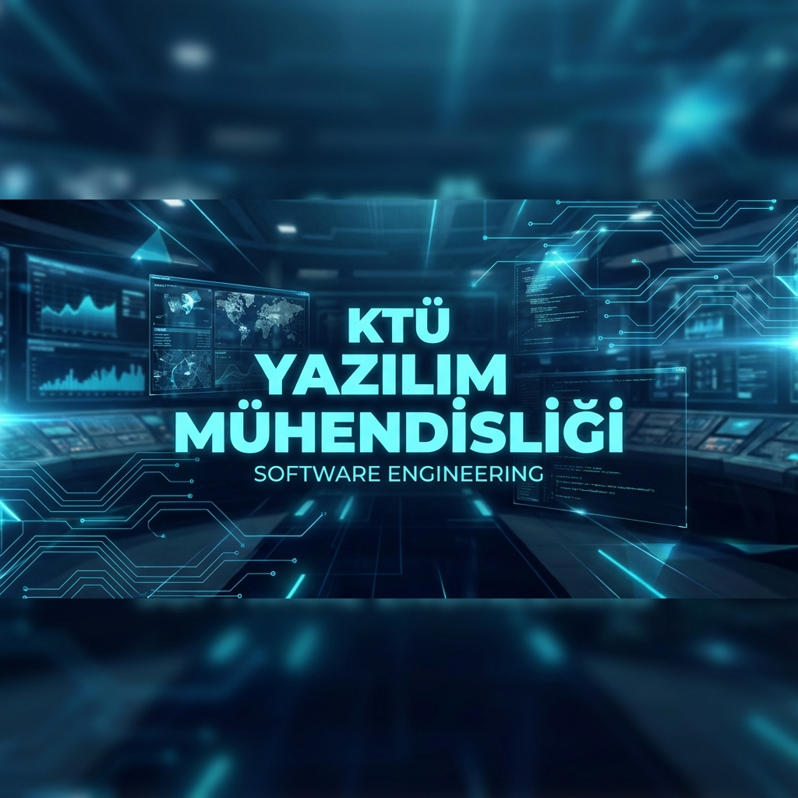
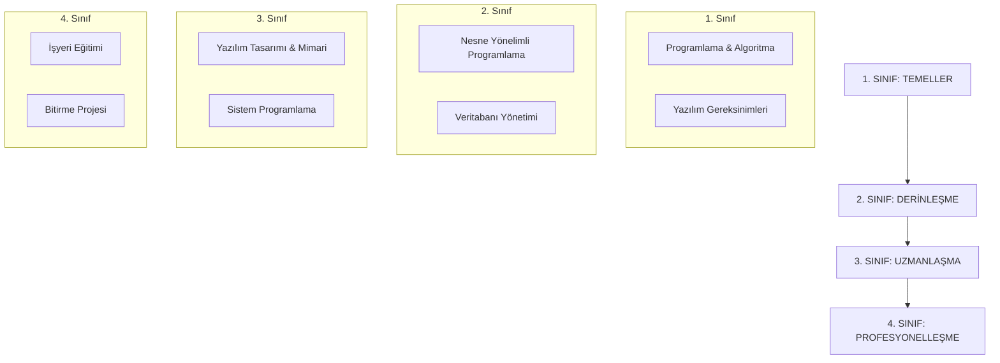

  

<h1 align="center">🚀 KTÜ Yazılım Mühendisliği: Elite Engineering Hub</h1>

  
  
  
  

---

## ⚡ Sistem Vizyonu
Karadeniz Teknik Üniversitesi Yazılım Mühendisliği bölümü öğrencilerinin akademik ve teknik gelişimlerini desteklemek amacıyla oluşturulmuş, stratejik bir bilgi deposudur. Bu repository, 2018-2022 yılları arasındaki köklü müfredatı, ders notlarını ve uygulama dökümanlarını modern bir mühendislik perspektifiyle sunar.

> [!IMPORTANT]
> **Erişim Protokolü:** Google Drive üzerindeki ders notlarına erişim sağlamak için bir defa tıklamanız yeterlidir. Erişim talebiniz gün içerisinde onaylanacaktır. Lütfen üst üste erişim isteği göndermeyiniz.

---

## 🛠️ Teknik Müfredat & Operasyonel Modüller

### 🎓 Akademik Yol Haritası

---

## 📂 Modüler Yapı & Drive Erişim Portalları

| Sınıf | Kapsam | Drive Erişim Portalı |
| :--- | :--- | :--- |
| **1. Sınıf** | Temel Programlama & Matematik | [🚀 Erişimi Başlat](https://drive.google.com/drive/folders/1Lhwr27jCRdOmonKVm2oBVRSof7MuwW9g?usp=sharing) |
| **2. Sınıf** | NYP & Veritabanı Sistemleri | [🚀 Erişimi Başlat](https://drive.google.com/drive/folders/1yx-dSXJR6-cxHJpYkMN7x0tphMJjXXDV?usp=sharing) |
| **3. Sınıf** | Mimari & Sistem Programlama | [🚀 Erişimi Başlat](https://drive.google.com/drive/folders/1ulGFiAq1KWu2x7RERYH0l9007GRTGZUR?usp=sharing) |
| **4. Sınıf** | Profesyonel Deneyim & Bitirme | [🚀 Erişimi Başlat](https://drive.google.com/drive/folders/1HdKvowfARe4kAzH2nu_WsV7Pxc5oiOZ3?usp=sharing) |

---

## ❓ Sıkça Sorulan Sorular (SSS)
Bölüm, lokasyon ve kariyer ile ilgili tüm sorularınız için [Stratejik SSS Dokümanı](SSS.md) sayfasını ziyaret ediniz.

---

## 📞 İletişim & Danışmanlık
Mezun danışmanlığı ve teknik destek için aşağıdaki kanalları kullanabilirsiniz:

*   **E-Posta:** `yyilmazrabiaa@gmail.com`
*   **LinkedIn:** [Rabia Yılmaz](https://www.linkedin.com/in/rabiayilmazz/)

---

  <b>Designed with &hearts; for KTÜ Software Engineers</b>

