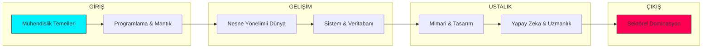

<p align="center">
  
</p>

<div align="center">

# 🌌 ASTRA DOMINUS // SENKRONİZASYON: TAMAMLANDI
### [ ELİT MÜHENDİSLİK ÜSSÜ & AKADEMİK REHBERLİK TERMİNALİ ]

<p align="center">
  
  
  
</p>

---

</div>

## 🎯 MİSYON VE VİZYON
**Astra Dominus**, Karadeniz Teknik Üniversitesi Yazılım Mühendisliği (2018-2022) akademik mirasını, sadece bir "not deposu" olmanın ötesine taşıyarak, dünya standartlarında bir **Öğrenme ve Mühendislik Ekosistemi**'ne dönüştürmek amacıyla inşa edilmiştir.

### 🏛️ Temel Amaçlarımız:
*   **Faydalı Olmak:** Karmaşık akademik bilgiyi, herkesin anlayabileceği ve uygulayabileceği netlikte sunmak.
*   **Yol Göstermek:** Bir mühendis adayının 1. sınıftan mezuniyete (ve ötesine) kadar olan yolculuğunda teknik ve stratejik akıl hocalığı yapmak.
*   **Öğretmek ve İlham Vermek:** Teorik bilgiyi "Mühendislik Pratiği" ve "Ustalık Doktrinleri" ile harmanlayarak bir vizyon kazandırmak.

---

## 🏗️ SİSTEM MİMARİSİ (DİZİN YAPISI)
Repo hiyerarşisi, profesyonel bir yazılım projesi standartlarında, stratejik katmanlara ayrılarak yapılandırılmıştır.

```text
📦 KTU-YAZILIM-MUHENDISLIGI
 ┣ 📂 DOKTRIN_VE_STRATEJI  — Anayasal felsefe, güvenlik ve katılım protokolleri.
 ┣ 📂 GELISIM_MERKEZI      — Kariyer rotaları, portfolyo rehberleri ve arşiv erişimi.
 ┣ 📂 TEKNIK_KUTUPHANE     — SOLID, SDLC, mülakat hazırlığı ve teknik sözlük.
 ┣ 📂 SISTEM_KODLAR        — Müfredat matrisi ve akademik istihbarat merkezi.
 ┣ 📂 1-4. SINIF           — Yıllara göre ders notları, projeler ve dökümanlar.
 ┗ 📜 README.md            — Ana komuta terminali.
```

---

## ⚡ AKADEMİK MATRİS (MÜFREDAT)

<details open>
<summary><b>🎓 [ 1-2. SINIF ] - TEMEL VE EVRİM</b></summary>

| SEVİYE | ODAK NOKTASI | BAĞLANTILAR |
| :--- | :--- | :--- |
| **01: TEMELLER** | Algoritma, C, Web Tasarımı, Matematik. | [📂 GİRİŞ](1.%20sınıf/README.md) |
| **02: EVRİM** | OOP (C#), Veritabanı, İşletim Sistemleri. | [📂 ERİŞİM](2.%20sınıf/README.md) |

</details>

<details>
<summary><b>🎓 [ 3-4. SINIF ] - SENTEZ VE DOMİNASYON</b></summary>

| SEVİYE | ODAK NOKTASI | BAĞLANTILAR |
| :--- | :--- | :--- |
| **03: SENTEZ** | Yazılım Mimarisi, Yapay Zeka, Sistem Programlama. | [📂 ANALİZ](3.%20sınıf/README.md) |
| **04: DOMİNASYON** | Bitirme Projesi, İşyeri Eğitimi (Staj), Test. | [📂 SEKTÖR](4.%20sınıf/README.md) |

</details>

---

## 🧠 PROFESYONEL GELİŞİM EKOSİSTEMİ
Teknik bilginizi profesyonel bir kariyere dönüştürmek için tasarlanmış "Aydınlanma" ve "Bilgelik" modülleri.

### 📍 Stratejik Rehberlik
*   **[⚓ Mühendislik Manifestosu](DOKTRIN_VE_STRATEJI/MANIFESTO.md):** Teknik felsefe ve yükseliş vizyonu.
*   **[🛣️ Kariyer Rotaları](GELISIM_MERKEZI/PATHWAYS.md):** Uzmanlık alanları ve gelecek planlaması.
*   **[🚀 Portfolyo & CV Rehberi](GELISIM_MERKEZI/PORTFOLYO.md):** Sektörde fark yaratma stratejileri.

### 📍 Teknik Derinlik
*   **[🧩 SOLID ve Mimari](TEKNIK_KUTUPHANE/SOLID_VE_MIMARI.md):** Sürdürülebilir sistem tasarım temelleri.
*   **[🔄 Yazılım Yaşam Döngüsü](TEKNIK_KUTUPHANE/YAZILIM_YASAM_DONGUSU.md):** Profesyonel ürün geliştirme süreçleri.
*   **[📖 Teknik Terimler Sözlüğü](TEKNIK_KUTUPHANE/TEKNIK_SOZLUK.md):** Terminoloji hakimiyeti.
*   **[🎤 Mülakat Hazırlığı](TEKNIK_KUTUPHANE/MULAKAT_ANTRENMANI.md):** Teknik mülakat antrenmanları.

---

## 📈 AKADEMİK EVRİM ŞEMASI



---

## 📓 SİSTEM KODEKSLERİ

<p align="center">
<a href="DOKTRIN_VE_STRATEJI/DOCTRINE.md"></a>
<a href="SISTEM_KODLAR/SYSTEM_CORE_MATRIX.md"></a>
<a href="SISTEM_KODLAR/INTEL_CENTER.md"></a>
<a href="DOKTRIN_VE_STRATEJI/SECURITY.md"></a>
<a href="GELISIM_MERKEZI/ARCHIVE_PROTOCOL.md"></a>
</p>

---

<div align="center">

**[ Kod Bir Sanattır. Mühendislik ise O Sanatı Dünyaya İnşa Etmektir. ]**

` Trabzon, TÜRKİYE ` // ` 2018 - 2022 Akademik Hafızası `

</div>
